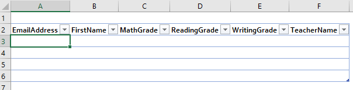

# Excel-Add-In MailMerge für TypeScript

Das Excel-Add-In MailMerge für TypeScript baut eine Verbindung mit Microsoft Graph auf, ruft E-Mail-Vorlagen aus einem Vorlagenordner in Outlook ab und sendet E-Mails an eine Liste von Empfängern in einer Excel-Tabelle.

## Voraussetzungen

Zur Ausführung des Beispiels benötigen Sie Folgendes:

* Visual Studio 2015
* TypeScript für Microsoft Visual Studio Version 2.0.6.0 (Mindestversion)
* [Node.js](https://nodejs.org/)
* Ein Office 365-Entwicklerkonto Wenn Sie kein Konto besitzen, [nehmen Sie am Office 365 Entwicklerprogramm teil, und erhalten Sie ein kostenloses 1-Jahres-Abonnement für Office 365](https://aka.ms/devprogramsignup).

## Ausführen des Add-Ins

### Registrieren einer App bei Microsoft Azure

Registrieren Sie im [Portal für die App-Registrierung](https://apps.dev.microsoft.com) eine Webanwendung mit folgender Konfiguration:

Parameter | Wert
---------|--------
Name | Excel-Add-in-Microsoft-Graph-MailMerge
Type | Webanwendung und/oder Web-API
Sign-on URL | https://localhost:44390/index.html
App ID URI | https://[Name des Azure AD-Mandanten].onmicrosoft.com/Excel-Add-in-Microsoft-Graph-MailMerge
Reply URL | https://localhost:44390/index.html

Fügen Sie die folgenden Berechtigungen hinzu:

Anwendung | Delegierte Berechtigungen
---------|--------
Microsoft Graph | E-Mails lesen/schreiben
Microsoft Azure Active Directory | Anmelden und Benutzerprofil lesen

Speichern Sie die Anwendung, und notieren Sie sich die *Client-ID*.

### Einrichten der Umgebung

1. Klonen Sie das GitHub-Repository.
3. Öffnen Sie in Visual Studio die Projektmappendatei „Excel-Add-in-Microsoft-Graph-MailMerge.sln“.

### Aktualisieren der Client-ID

* Öffnen Sie in Ihrem Visual Studio-Projekt „Excel-Add-in-Microsoft-Graph-MailMergeWeb/src/home/home.ts“.
* Geben Sie für „[Enter your clientID here]“ den Wert aus Ihrer Azure AD-Anwendung ein.
* Geben Sie für „[redirect Url]“ Ihre Umleitungs-URL ein.

### Ausführen des Add-Ins

1. Öffnen Sie im Verzeichnis „\<Beispielverzeichnis\>\Excel-Add-in-Microsoft-Graph-MailMergeWeb“ eine Eingabeaufforderung, und führen Sie den Befehl `npm install` aus. Führen Sie danach den Befehl `npm start` aus.
2. Drücken Sie in Visual Studio die Taste F5, um das Beispiel auszuführen.
3. Wählen Sie, sobald Excel geöffnet wird, auf der Registerkarte „Start“ die Befehlsschaltfläche **Mail Merge** aus.

4. Der Aufgabenbereich wird geöffnet. Nun können Sie sich per Klick auf **Sign in with Microsoft** mit Office 365-Anmeldeinformationen authentifizieren.
5. Wählen Sie eine Vorlage aus der Vorlagenliste aus.

6. Prüfen und bearbeiten Sie die Liste der Empfänger.

7. Sehen Sie sich die E-Mail-Vorschau an, und senden Sie die E-Mail.

## Fragen und Kommentare

Wir schätzen Ihr Feedback hinsichtlich dieses Beispiels. Sie können uns Ihre Fragen und Vorschläge über die Registerkarte [Issues](https://github.com/OfficeDev/Excel-Add-in-TypeScript-MailMerge/issues) dieses Repositorys senden.

Allgemeine Fragen zur Office 365-Entwicklung sollten in [Stack Overflow](http://stackoverflow.com/questions/tagged/office-addins) gestellt werden. Stellen Sie sicher, dass Ihre Fragen oder Kommentare mit [office-addins] getaggt sind.

## Zusätzliche Ressourcen

* [Office-Add-In-Beispiele](https://github.com/OfficeDev?utf8=%E2%9C%93&query=-add-in)
* [Plattformübersicht Office-Add-Ins](http://dev.office.com/docs/add-ins/overview/office-add-ins)
* [Erste Schritte mit Office-Add-Ins](http://dev.office.com/getting-started/addins)
* [Hilfsprogramme für die JavaScript-API für Office](https://github.com/OfficeDev/office-js-helpers)

## Copyright

Copyright (c) 2016 Microsoft Corporation. Alle Rechte vorbehalten.

