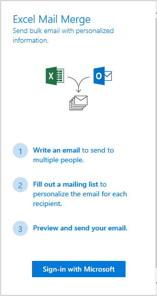
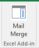
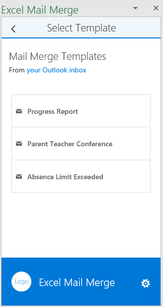
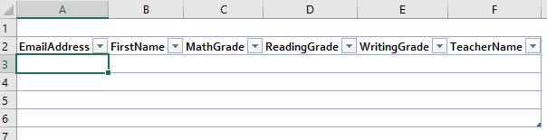
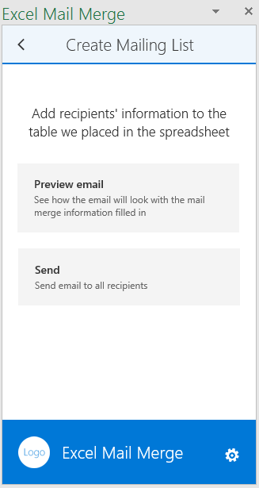

# Complément Excel TypeScript MailMerge

Le complément Excel de publipostage pour TypeScript se connecte à Microsoft Graph, récupère des modèles de courrier électronique à partir d’un dossier de modèles dans Outlook et envoie des courriers électroniques à partir d’une liste de destinataires dans un tableau Excel.

## Conditions préalables

Pour exécuter l’exemple, vous avez besoin des éléments suivants :

* Visual Studio 2015
* TypeScript pour Microsoft Visual Studio, version 2.0.6.0 au minimum
* [Node.js](https://nodejs.org/)
* Un compte de développeur Office 365 [Participez au programme pour les développeurs Office 365 et obtenez un abonnement gratuit d’un an à Office 365](https://aka.ms/devprogramsignup), si vous n’en avez pas.

## Exécution du complément

### Inscription de votre application dans Microsoft Azure

Inscrivez une application web dans le [portail d’inscription d’applications](https://apps.dev.microsoft.com) avec la configuration suivante :

Paramètre | Valeur
---------|--------
Nom | Excel-Add-in-Microsoft-Graph-MailMerge
Type | Application web et/ou API web
URL de connexion | https://localhost:44390/index.html
URI de l’ID d’application | https://[nom de locataire Azure AD].onmicrosoft.com/Excel-Add-in-Microsoft-Graph-MailMerge
URL de réponse | https://localhost:44390/index.html

Ajoutez les autorisations suivantes :

Application | Autorisations déléguées
---------|--------
Microsoft Graph | Lecture/Écriture de messages électroniques
Microsoft Azure Active Directory | Activer la connexion et lire le profil utilisateur

Enregistrez l’application et notez l’*ID client*.

### Configuration de votre environnement

1. Clonez le référentiel GitHub.
3. Dans Visual Studio, ouvrez le fichier solution Excel-Add-in-Microsoft-Graph-MailMerge.sln.

### Mise à jour de l’ID client

* Dans votre projet Visual Studio, ouvrez le fichier Excel-Add-in-Microsoft-Graph-MailMergeWeb/src/home/home.ts.
* Indiquez la valeur de votre application Azure AD dans « [Entrez l’ID client ici.] ».
* Indiquez votre URL de redirection dans « [URL de redirection] ».

### Exécution du complément

1. Ouvrez une invite de commande dans \<répertoire exemple\>\Excel-Add-in-Microsoft-Graph-MailMergeWeb, exécutez `npm install`, puis exécutez `npm start`.
2. Dans Visual Studio, appuyez sur la touche F5 pour exécuter l’exemple.
3. Une fois Excel ouvert, sélectionnez le bouton de commande **Publipostage** à partir de l’onglet Accueil.

4. Dans le volet Office qui apparaît, cliquez sur **Se connecter avec Microsoft** pour vous authentifier à l’aide des informations d’identification Office 365.
5. Faites votre choix dans la liste des modèles.

6. Consultez et modifiez la liste des destinataires.

7. Affichez un aperçu du courrier électronique et envoyez-le.

## Questions et commentaires

Nous serions ravis de connaître votre opinion sur cet exemple. Vous pouvez nous faire part de vos questions et suggestions dans la rubrique [Problèmes](https://github.com/OfficeDev/Excel-Add-in-TypeScript-MailMerge/issues) de ce référentiel.

Si vous avez des questions sur le développement d’Office 365, envoyez-les sur [Stack Overflow](http://stackoverflow.com/questions/tagged/office-addins). Posez vos questions ou envoyez vos commentaires avec la balise [office-addins].

## Ressources supplémentaires

* [Exemples de compléments Office](https://github.com/OfficeDev?utf8=%E2%9C%93&query=-add-in)
* [Vue d’ensemble de la plateforme des compléments Office](http://dev.office.com/docs/add-ins/overview/office-add-ins)
* [Prise en main des compléments Office](http://dev.office.com/getting-started/addins)
* [Applications auxiliaire de l’interface API JavaScript d’Office](https://github.com/OfficeDev/office-js-helpers)

## Copyright

Copyright (c) 2016 Microsoft Corporation. Tous droits réservés.

