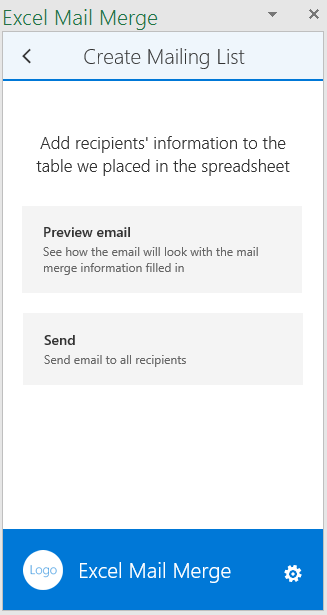

# Excel アドイン TypeScript MailMerge

TypeScript 用 Excel Mail Merge アドインは、Microsoft Graph に接続し、Outlook 内のテンプレート フォルダーからメール テンプレートを取得し、Excel テーブル内の受信者の一覧からメールを送信します。

## 前提条件

サンプルを実行するには、以下のものが必要です。

* Visual Studio 2015
* Microsoft Visual Studio 用 TypeScript 最小バージョン 2.0.6.0
* [Node.js](https://nodejs.org/)
* Office 365 開発者アカウント。お持ちでない場合は、[Office 365 Developer プログラムに参加して、Office 365 の 1 年間無料のサブスクリプションを取得](https://aka.ms/devprogramsignup)します。

## アドインを実行する

### Microsoft Azure でアプリを登録する

以下の構成を使用して、[アプリ登録ポータル](https://apps.dev.microsoft.com)で Web アプリケーションを登録します。

パラメーター | 値
---------|--------
名前 | Excel-Add-in-Microsoft-Graph-MailMerge
型 | Web アプリケーションまたは Web API、あるいはその両方
サインオン URL | https://localhost:44390/index.html
アプリ ID URI | https://[Azure AD テナント名].onmicrosoft.com/Excel-Add-in-Microsoft-Graph-MailMerge
応答 URL | https://localhost:44390/index.html

以下のアクセス許可を追加します。

アプリケーション | 委任されたアクセス許可
---------|--------
Microsoft Graph | メールの読み取り/書き込み
Microsoft Azure Active Directory | サインインおよびユーザー プロファイルの読み取り

アプリケーションを保存し、*クライアント ID* をメモします。

### 環境を設定する

1. GitHub リポジトリのクローンを作成します。
3. Visual Studio で、ソリューション ファイル Excel-Add-in-Microsoft-Graph-MailMerge.sln を開きます。

### クライアント ID を更新する

* Visual Studio プロジェクトで、Excel-Add-in-Microsoft-Graph-MailMergeWeb/src/home/home.ts を開きます。
* Azure AD アプリケーションの値を使用して、'[クライアント ID をここに入力]'` を更新します。
* リダイレクト URL を使用して、'[リダイレクト URL]' を更新します。

### アドインを実行する

1. コマンド プロンプトで、\<サンプル ディレクトリ\>\Excel-Add-in-Microsoft-Graph-MailMergeWeb を開き、`npm install` を実行し、処理が完了したら、`npm start` を実行します。
2. Visual Studio で、F5 キーを押してサンプルを実行します。
3. Excel が開いたら、[ホーム] タブから **[宛名の差し込み]** コマンド ボタンを選択します。

4. 作業ウィンドウが開き、**[Microsoft でサインインする]** をクリックすると、Office 365 の資格情報で認証できるようになります。
5. テンプレートの一覧から選択します。

6. 受信者のリストを確認し、編集します。

7. メールをプレビューし、送信します。

## 質問とコメント

このサンプルに関するフィードバックをお寄せください。質問や提案につきましては、このリポジトリの「[問題](https://github.com/OfficeDev/Excel-Add-in-TypeScript-MailMerge/issues)」セクションで送信できます。

Office 365 開発全般の質問につきましては、「[スタック オーバーフロー](http://stackoverflow.com/questions/tagged/office-addins)」に投稿してください。質問やコメントには、必ず [office-addins] のタグを付けてください。

## その他のリソース

* [Office アドインのサンプル](https://github.com/OfficeDev?utf8=%E2%9C%93&query=-add-in)
* [Office アドイン プラットフォームの概要](http://dev.office.com/docs/add-ins/overview/office-add-ins)
* [Office アドインを使う](http://dev.office.com/getting-started/addins)
* [Office の JavaScript API ヘルパー](https://github.com/OfficeDev/office-js-helpers)

## 著作権

Copyright (c) 2016 Microsoft Corporation. All rights reserved.

