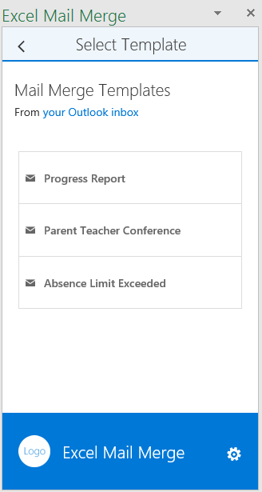

# Надстройка MailMerge для Excel (TypeScript)

Надстройка Excel для слияния почты на базе TypeScript подключается к Microsoft Graph, получает шаблоны писем из папки с шаблонами в Outlook, а затем отправляет почту, используя список получателей в таблице Excel.

## Необходимые условия

Для запуска примера кода вам потребуются:

* Visual Studio 2015.
* TypeScript для Microsoft Visual Studio версии 2.0.6.0 или более поздней.
* [Node.js](https://nodejs.org/)
* Учетная запись разработчика решений для Office 365. Если у вас нет такой учетной записи, [примите участие в программе для разработчиков касательно Office 365 и получите бесплатную подписку на Office 365 сроком на 1 год](https://aka.ms/devprogramsignup).

## Запуск надстройки

### Регистрация приложения в Microsoft Azure

Зарегистрируйте веб-приложение на [портале регистрации приложений](https://apps.dev.microsoft.com), использую следующую конфигурацию:

Параметр | Значение
---------|--------
Имя | Excel-Add-in-Microsoft-Graph-MailMerge
Тип | Веб-приложение или веб-API
URL-адрес входа | https://localhost:44390/index.html
URI идентификатора приложения | https://[имя клиента Azure AD].onmicrosoft.com/Excel-Add-in-Microsoft-Graph-MailMerge
URL-адрес ответа | https://localhost:44390/index.html

Добавьте указанные ниже разрешения.

Приложение | Делегированные разрешения
---------|--------
Microsoft Graph | Чтение и запись почты
Microsoft Azure Active Directory | Вход и чтение профиля пользователя

Сохраните приложение и запишите *идентификатор клиента*.

### Настройка среды

1. Клонируйте репозиторий GitHub.
3. В Visual Studio откройте файл решения Excel-Add-in-Microsoft-Graph-MailMerge.sln.

### Обновление идентификатора клиента

* В проекте Visual Studio откройте Excel-Add-in-Microsoft-Graph-MailMergeWeb/src/home/home.ts.
* В разделе "Enter your clientId here" (Введите здесь идентификатор клиента) добавьте значение из приложения Azure AD.
* В разделе "redirect Url" введите URL-адрес перенаправления.

### Запуск надстройки

1. Откройте в командной строке \<sample directory\>\Excel-Add-in-Microsoft-Graph-MailMergeWeb и запустите `npm install`. Когда команда будет выполнена, запустите `npm start`.
2. В Visual Studio нажмите клавишу F5 для запуска примера.
3. Когда откроется Excel, нажмите кнопку **Mail Merge** (Слияние почты) на вкладке "Главная".

4. Откроется область задач, и вы сможете пройти проверку подлинности с использованием учетных данных Office 365, когда выберите **Вход под учетными данными Microsoft**.
5. Выберите в списке один из шаблонов.

6. Проверьте и при необходимости измените список получателей.

7. Просмотрите и отправьте сообщение.

## Вопросы и комментарии

Мы будем рады узнать ваше мнение об этом примере. Вы можете отправлять нам вопросы и предложения на вкладке [Issues](https://github.com/OfficeDev/Excel-Add-in-TypeScript-MailMerge/issues) (Вопросы) этого репозитория.

Общие вопросы о разработке решений для Office 365 следует задавать на сайте [Stack Overflow](http://stackoverflow.com/questions/tagged/office-addins). Обязательно помечайте свои вопросы и комментарии тегом [office-addins].

## Дополнительные ресурсы

* [Примеры надстроек Office](https://github.com/OfficeDev?utf8=%E2%9C%93&query=-add-in)
* [Обзор платформы надстроек Office](http://dev.office.com/docs/add-ins/overview/office-add-ins)
* [Начало работы с надстройками Office](http://dev.office.com/getting-started/addins)
* [Вспомогательные средства API JavaScript для Office](https://github.com/OfficeDev/office-js-helpers)

## Авторское право

© Корпорация Майкрософт (Microsoft Corporation), 2016 г. Все права защищены.

