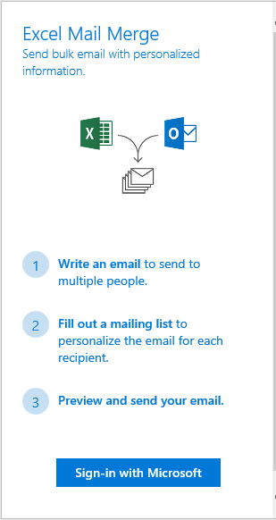

# Excel 增益集 TypeScript 合併列印

適用於 TypeScript 的 Excel 合併列印增益集，會連線到 Microsoft Graph，從 Outlook 中的範本資料夾取得電子郵件範本，並以來自 Excel 表格中的收件者清單傳送郵件。

## 必要條件

若要執行範例，您會需要︰

* Visual Studio 2015
* Microsoft Visual Studio 的 TypeScript (最小版本 2.0.6.0)
* [Node.js](https://nodejs.org/)
* Office 365 開發人員帳戶。如果沒有的話，[參加 Office 365 開發人員計劃，並取得 Office 365 的免費 1 年訂用帳戶](https://aka.ms/devprogramsignup)。

## 執行增益集

### 在 Microsoft Azure 中註冊您的應用程式

在 [應用程式註冊入口網站](https://apps.dev.microsoft.com) 中，以下列設定註冊 Web 應用程式︰

參數 | 值
---------|--------
名稱 | Excel-Add-in-Microsoft-Graph-MailMerge
類型 | Web 應用程式和/或 Web API
登入 URL | https://localhost:44390/index.html
應用程式 ID URI | https://[your azure ad tenant name].onmicrosoft.com/Excel-Add-in-Microsoft-Graph-MailMerge
回覆 URL | https://localhost:44390/index.html

新增下列權限︰

應用程式 | 委派的權限
---------|--------
Microsoft Graph | 讀取/寫入郵件
Microsoft Azure Active Directory | 登入並讀取使用者設定檔

儲存應用程式，並記下 [用戶端 ID]**。

### 設立您的環境

1. 複製 GitHub 儲存機制。
3. 在 Visual Studio 中，開啟方案檔 Excel-Add-in-Microsoft-Graph-MailMerge.sln。

### 更新用戶端 ID

* 在 Visual Studio 專案中，開啟 [Excel-Add-in-Microsoft-Graph-MailMergeWeb/src/home/home.ts]。
* 以您 Azure AD 應用程式中的值，更新 '[Enter your clientId here]'`。
* 以您的重新導向 URL，更新 '[redirect Url]'。

### 執行增益集

1. 開啟 [範例目錄]\<\>\Excel-Add-in-Microsoft-Graph-MailMergeWeb 的命令提示字元，並執行 `npm install`，完成後執行 `npm start`。
2. 在 Visual Studio 中，請按 F5 以執行範例。
3. 當 Excel 開啟時，從 [常用] 索引標籤，選取 [合併列印]**** 命令按鈕。

4. 工作窗格隨即開啟，一旦您按一下 [登入 Microsoft]****，就可以使用 Office 365 認證進行驗證。
5. 從範本清單中選取。

6. 檢閱及編輯收件者清單。

7. 預覽並傳送電子郵件。

## 問題和建議

我們很樂於收到您對於此範例的意見反應。您可以在此儲存機制的 [問題](https://github.com/OfficeDev/Excel-Add-in-TypeScript-MailMerge/issues) 區段中，將您的問題及建議傳送給我們。

請在 [Stack Overflow](http://stackoverflow.com/questions/tagged/office-addins) 提出有關 Office 365 開發的一般問題。請務必以 [office-addins] 標記您的問題和建議。

## 其他資源

* [Office 增益集範例](https://github.com/OfficeDev?utf8=%E2%9C%93&query=-add-in)
* [Office 增益集平台概觀](http://dev.office.com/docs/add-ins/overview/office-add-ins)
* [Office 增益集入門](http://dev.office.com/getting-started/addins)
* [Office JavaScript API 協助程式](https://github.com/OfficeDev/office-js-helpers)

## 著作權

Copyright (c) 2016 Microsoft Corporation 著作權所有，並保留一切權利。

