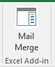

# Excel Add-in TypeScript MailMerge

The Excel Mail Merge Add-in for TypeScript connects to Microsoft Graph, gets email templates from a template folder in Outlook, and sends mail from a list of recipients in an Excel table. 

## Prerequisites

To run the sample, you will need:

* Visual Studio 2015
* TypeScript for Microsoft Visual Studio min version 2.0.6.0 
* [Node.js](https://nodejs.org/) 
* An Office 365 developer account. If you don't have one, [join the Office 365 Developer Program and get a free 1 year subscription to Office 365](https://aka.ms/devprogramsignup).

## Run the add-in

### Register your app in Microsoft Azure

Register a web application in the [app registration portal](https://apps.dev.microsoft.com) with the following configuration:

Parameter | Value
---------|--------
Name | Excel-Add-in-Microsoft-Graph-MailMerge
Type | Web application and/or web API
Sign-on URL | https://localhost:44390/index.html
App ID URI | https://[your azure ad tenant name].onmicrosoft.com/Excel-Add-in-Microsoft-Graph-MailMerge
Reply URL | https://localhost:44390/index.html

Add the following permissions:

Application | Delegated Permissions
---------|--------
Microsoft Graph | Read/Write Mail
Microsoft Azure Active Directory | Sign in and read user profile

Save the application and make note of the *client ID*.

### Set up your environment

1. Clone the GitHub repository.
3. In Visual Studio, open the solution file Excel-Add-in-Microsoft-Graph-MailMerge.sln.

### Update the client id

* In your Visual Studio project, open Excel-Add-in-Microsoft-Graph-MailMergeWeb/app/app.ts.
* Update `clientId: '[Enter your clientId here]'` with the value from your Azure AD application.

### Run the add-in 
  
1. Open a command prompt to \<sample directory\>\Excel-Add-in-Microsoft-Graph-MailMergeWeb and run `npm install` and when that is finished, run `npm start`.
2. In Visual Studio, press F5 to run the sample. 
3. When Excel opens, select the **Mail Merge** command button from the Home tab. 

4. The task pane will open and you will be able to authenticate with Office 365 credentials once you click **Sign In with Microsoft**.
5. Select from the list of templates. 

6. Review and edit the list of recipients. 

7. Preview and send the email. 

## Questions and comments

We'd love to get your feedback about this sample. You can send your questions and suggestions to us in the [Issues](https://github.com/OfficeDev/Excel-Add-in-TypeScript-MailMerge/issues) section of this repository.

Questions about Office 365 development in general should be posted to [Stack Overflow](http://stackoverflow.com/questions/tagged/office-addins). Make sure that your questions or comments are tagged with [office-addins].
  
## Additional resources

* [Office Add-in samples](https://github.com/OfficeDev?utf8=%E2%9C%93&query=-add-in)
* [Office Add-ins platform overview](http://dev.office.com/docs/add-ins/overview/office-add-ins)
* [Get started with Office Add-ins](http://dev.office.com/getting-started/addins)
* [Office JavaScript API Helpers](https://github.com/OfficeDev/office-js-helpers)

## Copyright

Copyright (c) 2016 Microsoft Corporation. All rights reserved.

